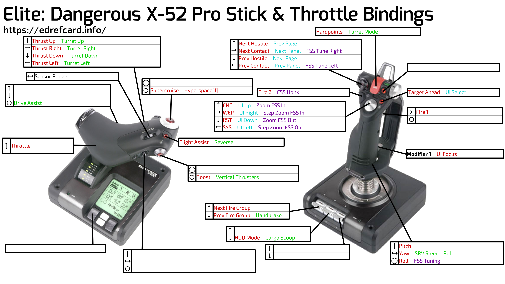

# [Elite Dangerous](https://www.elitedangerous.com/) controller bindings

Images generated by [EDRefCard](https://edrefcard.info/).

## Hardware

  * [Saitek X52 Pro](http://www.saitek.com/uk/prod/x52pro.html)
  * [TrackIR 5](https://www.naturalpoint.com/trackir/trackir5/)
  * [Korg Nanopad2](https://www.korg.com/us/products/computergear/nanopad2/), using https://github.com/Floppy/midi-dangerous to map to keys

## Installation

To use (based on Steam install on Windows 10), copy:

  * `Custom.3.0.binds` -> `/Users/{you}/AppData/Local/Frontier\ Developments/Elite\ Dangerous/Options/Bindings`

## Contact

Get in touch in-game: I'm [CMDR Furtive](http://inara.cz/cmdr/23164). Right on, Commander!
